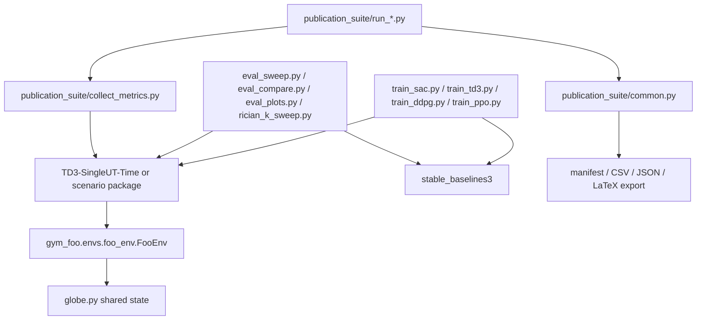

# UAV-RIS Repository Audit

This repository already contains the core pieces needed for a publication-oriented UAV-RIS benchmark:
training entry points, evaluation scripts, a publication suite, and scenario-specific environments.

## Major dependency graph

## Environment families discovered

- DDPG-MultiUT-Time
- DDPG-SingleUT-Time
- DDPG-SingleUT-Two
- Exhaustive-MultiUT-Time
- Exhaustive-MultiUT-Two
- Exhaustive-SingleUT-Time
- Exhaustive-SingleUT-Two
- SD3-MultiUT-Time
- SD3-MultiUT-Two
- SD3-SingleUT-Time
- SD3-SingleUT-Two
- TD3-MultiUT-Time
- TD3-MultiUT-Two
- TD3-SingleUT-Time
- TD3-SingleUT-Two

## Checkpoint loading and saving

- `train_sac.py`, `train_td3.py`, `train_ddpg.py`, and `train_ppo.py` save SB3 `.zip` models under the configured log directory.
- `eval_sweep.py`, `eval_compare.py`, and `eval_plots.py` load those `.zip` files with `stable_baselines3.load(...)`.
- `rician_k_sweep.py` saves per-K checkpoints and a latest checkpoint for resumption.
- SD3 scenarios use the native checkpoint directory layout under `checkpoints/models/model`.

## Publication suite

The `publication_suite/` package now exposes runnable scripts for:

- matrix evaluation
- ablation
- robustness (seed sweep)
- scalability (user-count sweep)
- figure export
- LaTeX table export
- reproducibility report generation

## Compatibility fixes applied in this pass

- Fixed a `from __future__` ordering error in `publication_suite/collect_metrics.py`.
- Fixed the `Rician_K` / `RicianK` mismatch in `eval_sweep.py`.
- Added direct-execution support to the publication-suite scripts so they can run as `python publication_suite/<script>.py`.

## What is intentionally preserved

- TD3, DDPG, SD3, SAC, PPO
- Fermat and KMeans trajectories
- legacy checkpoints
- legacy observation and reward behavior
- existing channel and energy-harvesting equations
